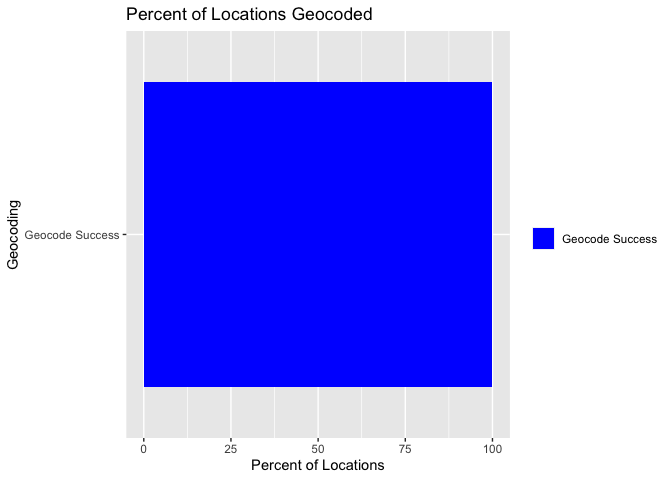

<!-- README.md is generated from README.Rmd. Please edit that file -->

# WEED (Wrangler for Emergency Events Database)

<!-- badges: start -->

<!-- badges: end -->

The goal of weed is to make the analysis of EM-DAT and related datasets
easier, with most of the pre-processing abstracted away by functions in
this package\!

## Pre Requisites

Installation of the following packages : readxl, dplyr, magrittr,
tidytext, stringr, tibble, geonames, countrycode, purrr, tidyr, forcats,
ggplot2.

You also need a geonames user account if you intend to use the geocoding
functionality of this package. Info on how to get one for free is
available [here](https://www.geonames.org/manual.html).

## Installation

You can install the development version from
[GitHub](https://github.com/rammkripa/weed) with:

``` r
# install.packages("devtools")
devtools::install_github("rammkripa/weed")
```

# Example

This is a basic example which shows a common `weed` workflow:

# Loading the Data

``` r
em <- read_emdat("/Users/ramkripa/Desktop/Tk2.xlsx", file_data = TRUE)
#> New names:
#> * `` -> ...1
#> * `` -> ...2
```

# Locationizing the Data

``` r
locationized_data <- em$disaster_data %>%
  tail() %>%
  split_locations(column_name = "Location") %>%
  head()
locationized_data %>%
  select(`Dis No`, Location,location_word, Latitude, Longitude)
#> # A tibble: 6 x 5
#>   `Dis No`   Location                           location_word Latitude Longitude
#>   <chr>      <chr>                              <chr>         <chr>    <chr>    
#> 1 2019-0515… Handeni district (Tanga Region)    handeni       <NA>     <NA>     
#> 2 2019-0515… Handeni district (Tanga Region)    tanga         <NA>     <NA>     
#> 3 2019-0562… Mwanza district                    mwanza        <NA>     <NA>     
#> 4 2020-0164… West Pokot, Elgeyo Marakwet, Kisu… west pokot    116.343  365.935  
#> 5 2020-0164… West Pokot, Elgeyo Marakwet, Kisu… elgeyo marak… 116.343  365.935  
#> 6 2020-0164… West Pokot, Elgeyo Marakwet, Kisu… kisumu        116.343  365.935
```

There are two problems with the Dataset as it exists here.

1.  Half of our observations, even in this toy dataset, don’t have
    Lat/Long data

2.  The Lat/Long here is blatantly wrong.

Lat \> 90? Long \> 360? How is this possible?

So, we must recode this Lat/Long data

# Solving Problem 1: Our locations have very little Lat/Long data

``` r
locationized_data %>%
  percent_located_locations(lat_column = "Latitude",
                            lng_column = "Longitude")
```


# Solving Problem 2: Geocoding the Locationized Data

A reminder that you need a geonames username to access this feature of
the `weed` package.

More info available [here](https://www.geonames.org/manual.html).

``` r
geocoded_data <- locationized_data %>%
  geocode(geonames_username = dummy_name)
geocoded_data %>%
  select(`Dis No`, Location,location_word, lat, lng)
#> # A tibble: 6 x 5
#>   `Dis No`    Location                                location_word    lat   lng
#>   <chr>       <chr>                                   <chr>          <dbl> <dbl>
#> 1 2019-0515-… Handeni district (Tanga Region)         handeni       -5.55   38.3
#> 2 2019-0515-… Handeni district (Tanga Region)         tanga         -5.07   39.1
#> 3 2019-0562-… Mwanza district                         mwanza        -2.52   32.9
#> 4 2020-0164-… West Pokot, Elgeyo Marakwet, Kisumu, H… west pokot     1.75   35.2
#> 5 2020-0164-… West Pokot, Elgeyo Marakwet, Kisumu, H… elgeyo marak…  0.516  35.5
#> 6 2020-0164-… West Pokot, Elgeyo Marakwet, Kisumu, H… kisumu        -0.102  34.8
```

Side note: These Lat/Long data look much better than before, given that
Kenya is close to the equator\!

# How effective was our geocoding?

``` r
geocoded_data %>%
  percent_located_locations()
```



``` r
geocoded_data %>%
  percent_located_disasters()
```


# Check if the locations are in a Lat Long Box\!\!

``` r
geocoded_data %>%
  located_in_box(top_left_lat = 0, 
                 top_left_lng = 35, 
                 bottom_right_lat = -6, 
                 bottom_right_lng = 40) %>%
  glimpse()
#> Rows: 6
#> Columns: 47
#> $ `Dis No`                          <chr> "2019-0515-TZA", "2019-0515-TZA", "…
#> $ Year                              <chr> "2019", "2019", "2019", "2020", "20…
#> $ Seq                               <chr> "0515", "0515", "0562", "0164", "01…
#> $ `Disaster Group`                  <chr> "Natural", "Natural", "Natural", "N…
#> $ `Disaster Subgroup`               <chr> "Hydrological", "Hydrological", "Hy…
#> $ `Disaster Type`                   <chr> "Flood", "Flood", "Flood", "Flood",…
#> $ `Disaster Subtype`                <chr> NA, NA, "Riverine flood", NA, NA, NA
#> $ `Disaster Subsubtype`             <chr> NA, NA, NA, NA, NA, NA
#> $ `Event Name`                      <chr> NA, NA, NA, NA, NA, NA
#> $ `Entry Criteria`                  <chr> "Kill", "Kill", "Kill", "Kill", "Ki…
#> $ Country                           <chr> "Tanzania, United Republic of", "Ta…
#> $ ISO                               <chr> "TZA", "TZA", "TZA", "KEN", "KEN", …
#> $ Region                            <chr> "Eastern Africa", "Eastern Africa",…
#> $ Continent                         <chr> "Africa", "Africa", "Africa", "Afri…
#> $ Location                          <chr> "Handeni district (Tanga Region)", …
#> $ Origin                            <chr> NA, NA, NA, "Heavy rains", "Heavy r…
#> $ `Associated Dis`                  <chr> NA, NA, NA, "Slide (land, mud, snow…
#> $ `Associated Dis2`                 <chr> NA, NA, NA, NA, NA, NA
#> $ `OFDA Response`                   <chr> NA, NA, NA, NA, NA, NA
#> $ Appeal                            <chr> NA, NA, NA, NA, NA, NA
#> $ Declaration                       <chr> NA, NA, NA, NA, NA, NA
#> $ `Aid Contribution`                <dbl> NA, NA, NA, NA, NA, NA
#> $ `Dis Mag Value`                   <dbl> NA, NA, NA, 154390, 154390, 154390
#> $ `Dis Mag Scale`                   <chr> "Km2", "Km2", "Km2", "Km2", "Km2", …
#> $ Latitude                          <chr> NA, NA, NA, "116.343", "116.343", "…
#> $ Longitude                         <chr> NA, NA, NA, "365.935", "365.935", "…
#> $ `Local Time`                      <chr> NA, NA, NA, NA, NA, NA
#> $ `River Basin`                     <chr> NA, NA, NA, NA, NA, NA
#> $ `Start Year`                      <dbl> 2019, 2019, 2019, 2020, 2020, 2020
#> $ `Start Month`                     <dbl> 10, 10, 11, 3, 3, 3
#> $ `Start Day`                       <dbl> 15, 15, 20, 24, 24, 24
#> $ `End Year`                        <dbl> 2019, 2019, 2019, 2020, 2020, 2020
#> $ `End Month`                       <dbl> 10, 10, 11, 5, 5, 5
#> $ `End Day`                         <dbl> 28, 28, 25, 31, 31, 31
#> $ `Total Deaths`                    <dbl> 14, 14, 10, 285, 285, 285
#> $ `No Injured`                      <dbl> NA, NA, NA, NA, NA, NA
#> $ `No Affected`                     <dbl> NA, NA, NA, 810655, 810655, 810655
#> $ `No Homeless`                     <dbl> NA, NA, NA, NA, NA, NA
#> $ `Total Affected`                  <dbl> NA, NA, NA, 810655, 810655, 810655
#> $ `Reconstruction Costs ('000 US$)` <dbl> NA, NA, NA, NA, NA, NA
#> $ `Insured Damages ('000 US$)`      <dbl> NA, NA, NA, NA, NA, NA
#> $ `Total Damages ('000 US$)`        <dbl> NA, NA, NA, NA, NA, NA
#> $ CPI                               <dbl> 100, 100, 100, NA, NA, NA
#> $ location_word                     <chr> "handeni", "tanga", "mwanza", "west…
#> $ lat                               <dbl> -5.55032, -5.06893, -2.51667, 1.750…
#> $ lng                               <dbl> 38.34768, 39.09875, 32.90000, 35.25…
#> $ in_box                            <lgl> TRUE, TRUE, FALSE, FALSE, FALSE, FA…
```

# Want to re-nest the location data?

``` r
geocoded_data %>%
  nest_locations() %>%
  select(`Dis No`, location_data)
#> # A tibble: 6 x 2
#>   `Dis No`           location_data
#>   <chr>         <list<tbl_df[,4]>>
#> 1 2019-0515-TZA            [2 × 4]
#> 2 2019-0515-TZA            [2 × 4]
#> 3 2019-0562-TZA            [1 × 4]
#> 4 2020-0164-KEN            [3 × 4]
#> 5 2020-0164-KEN            [3 × 4]
#> 6 2020-0164-KEN            [3 × 4]
```
