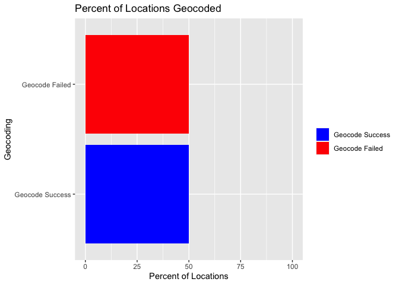

<!-- README.md is generated from README.Rmd. Please edit that file -->

# WEED (Wrangler for Emergency Events Database)

<!-- badges: start -->

<!-- badges: end -->

The goal of weed is to make the analysis of EM-DAT and related datasets
easier, with most of the pre-processing abstracted away by functions in
this package\!

## Installation

You can install the released version of weed from
[CRAN](https://CRAN.R-project.org) with:

``` r
install.packages("weed")
```

And the development version from [GitHub](https://github.com/) with:

``` r
# install.packages("devtools")
devtools::install_github("rammkripa/weed")
```

# Example

This is a basic example which shows a common `weed` workflow:

# Loading the Data

``` r
em <- read_emdat("/Users/ramkripa/Desktop/Tk2.xlsx", file_data = TRUE)
#> New names:
#> * `` -> ...1
#> * `` -> ...2
```

# Locationizing the Data

``` r
locationized_data <- em$disaster_data %>%
  tail() %>%
  split_locations(column_name = "Location") %>%
  head()
locationized_data %>%
  select(`Dis No`, Location,location_word, Country)
#> # A tibble: 6 x 4
#>   `Dis No`   Location                             location_word  Country        
#>   <chr>      <chr>                                <chr>          <chr>          
#> 1 2019-0515… Handeni district (Tanga Region)      handeni        Tanzania, Unit…
#> 2 2019-0515… Handeni district (Tanga Region)      tanga          Tanzania, Unit…
#> 3 2019-0562… Mwanza district                      mwanza         Tanzania, Unit…
#> 4 2020-0164… West Pokot, Elgeyo Marakwet, Kisumu… west pokot     Kenya          
#> 5 2020-0164… West Pokot, Elgeyo Marakwet, Kisumu… elgeyo marakw… Kenya          
#> 6 2020-0164… West Pokot, Elgeyo Marakwet, Kisumu… kisumu         Kenya
```

# However, our locations have very little Lat/Long data

``` r
locationized_data %>%
  percent_located_locations(lat_column = "Latitude",
                            lng_column = "Longitude")
```



# Geocoding the Locationized Data

``` r
geocoded_data <- locationized_data %>%
  geocode(geonames_username = "rammkripa")
geocoded_data
#> # A tibble: 6 x 46
#>   `Dis No` Year  Seq   `Disaster Group` `Disaster Subgr… `Disaster Type`
#>   <chr>    <chr> <chr> <chr>            <chr>            <chr>          
#> 1 2019-05… 2019  0515  Natural          Hydrological     Flood          
#> 2 2019-05… 2019  0515  Natural          Hydrological     Flood          
#> 3 2019-05… 2019  0562  Natural          Hydrological     Flood          
#> 4 2020-01… 2020  0164  Natural          Hydrological     Flood          
#> 5 2020-01… 2020  0164  Natural          Hydrological     Flood          
#> 6 2020-01… 2020  0164  Natural          Hydrological     Flood          
#> # … with 40 more variables: `Disaster Subtype` <chr>, `Disaster
#> #   Subsubtype` <chr>, `Event Name` <chr>, `Entry Criteria` <chr>,
#> #   Country <chr>, ISO <chr>, Region <chr>, Continent <chr>, Location <chr>,
#> #   Origin <chr>, `Associated Dis` <chr>, `Associated Dis2` <chr>, `OFDA
#> #   Response` <chr>, Appeal <chr>, Declaration <chr>, `Aid Contribution` <dbl>,
#> #   `Dis Mag Value` <dbl>, `Dis Mag Scale` <chr>, Latitude <chr>,
#> #   Longitude <chr>, `Local Time` <chr>, `River Basin` <chr>, `Start
#> #   Year` <dbl>, `Start Month` <dbl>, `Start Day` <dbl>, `End Year` <dbl>, `End
#> #   Month` <dbl>, `End Day` <dbl>, `Total Deaths` <dbl>, `No Injured` <dbl>,
#> #   `No Affected` <dbl>, `No Homeless` <dbl>, `Total Affected` <dbl>,
#> #   `Reconstruction Costs ('000 US$)` <dbl>, `Insured Damages ('000
#> #   US$)` <dbl>, `Total Damages ('000 US$)` <dbl>, CPI <dbl>,
#> #   location_word <chr>, lat <dbl>, lng <dbl>
```

# How effective was our geocoding?

``` r
geocoded_data %>%
  percent_located_locations()
```


# Want to re-nest the location data?

``` r
geocoded_data %>%
  nest_locations()
#> # A tibble: 6 x 44
#>   `Dis No` Year  Seq   `Disaster Group` `Disaster Subgr… `Disaster Type`
#>   <chr>    <chr> <chr> <chr>            <chr>            <chr>          
#> 1 2019-05… 2019  0515  Natural          Hydrological     Flood          
#> 2 2019-05… 2019  0515  Natural          Hydrological     Flood          
#> 3 2019-05… 2019  0562  Natural          Hydrological     Flood          
#> 4 2020-01… 2020  0164  Natural          Hydrological     Flood          
#> 5 2020-01… 2020  0164  Natural          Hydrological     Flood          
#> 6 2020-01… 2020  0164  Natural          Hydrological     Flood          
#> # … with 38 more variables: `Disaster Subtype` <chr>, `Disaster
#> #   Subsubtype` <chr>, `Event Name` <chr>, `Entry Criteria` <chr>,
#> #   Country <chr>, ISO <chr>, Region <chr>, Continent <chr>, Location <chr>,
#> #   Origin <chr>, `Associated Dis` <chr>, `Associated Dis2` <chr>, `OFDA
#> #   Response` <chr>, Appeal <chr>, Declaration <chr>, `Aid Contribution` <dbl>,
#> #   `Dis Mag Value` <dbl>, `Dis Mag Scale` <chr>, Latitude <chr>,
#> #   Longitude <chr>, `Local Time` <chr>, `River Basin` <chr>, `Start
#> #   Year` <dbl>, `Start Month` <dbl>, `Start Day` <dbl>, `End Year` <dbl>, `End
#> #   Month` <dbl>, `End Day` <dbl>, `Total Deaths` <dbl>, `No Injured` <dbl>,
#> #   `No Affected` <dbl>, `No Homeless` <dbl>, `Total Affected` <dbl>,
#> #   `Reconstruction Costs ('000 US$)` <dbl>, `Insured Damages ('000
#> #   US$)` <dbl>, `Total Damages ('000 US$)` <dbl>, CPI <dbl>,
#> #   data <list<tbl_df[,4]>>
```
